# Practica 1 - Manejo de discos.

-Integrantes-
- Sebastián Azamar Avilés.
- Karime Aylen de la Cruz Vargas.
- Carolina Gonzalez Gonzalez.
- Martín Granados Reyes.

# 1. Diferencia entra hda, sda, vda.

Los nombres de los discos en Linux están en orden alfabético. Dentro de Linux se pueden encontrar discos como __hda__, el cual es el controlador IDE maestro. Por otra parte, sda es la abreviatura para el controlador de almacenamiento masivo Small Computer System Interface __(SCSI)__, a diferencia de hda que es una unidad __IDE__. Dado que el nombre de los discos esta en orden alfabético sda representa el primer ID SCSI de disco SCSI por direcciones, __sdb__ representa la segunda ID SCSI de disco SCSI. Los números que se encuentran al final de cada __sda__, como __sda1__, __sda2__, etc. representan las particiones del disco por lo que sda1 es la primera partición del disco, sda2 es la segunda partición del disco, y así sucesivamente.
 __vda__ es el primer disco que utiliza el controlador de disco compatible con virtualización.   

# 2. ¿Cómo montar y desmontar un usb en el sistema por terminal?

1.- Primero mostramos los discos actuales.

```bash
sudo lsblk
```

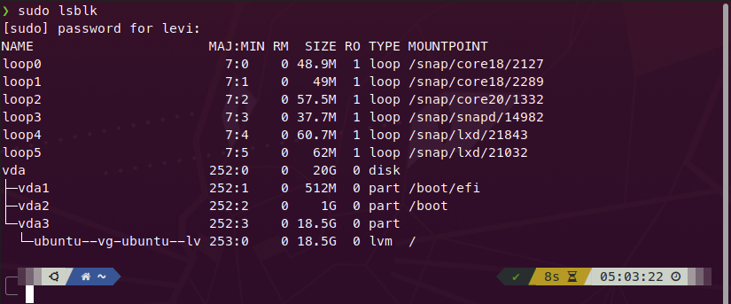

2.- Conectamos la USB y volvemos a mostrar la información de los discos.

```bash
sudo lsblk
```

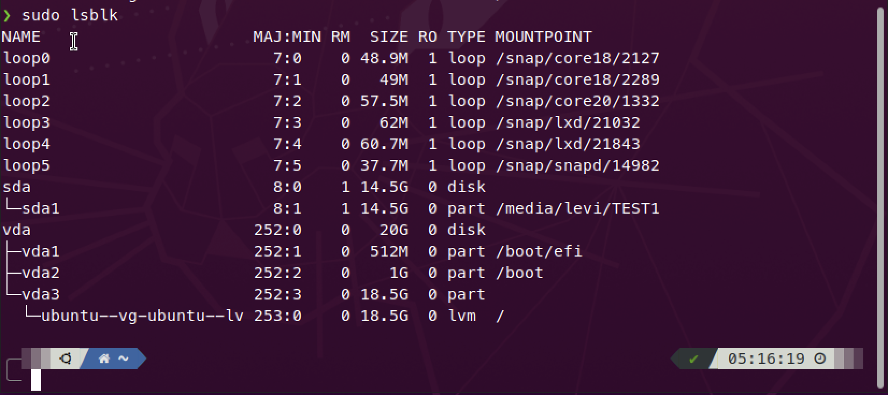

3.- Sabemos que la USB esta montada como el disco __sda__ en el path __/media/levi/TEST1__. Para desmontar la USB usamos el siguiente comando.

```bash
sudo umount /dev/sda1
```

4.- Volvemos a mostrar los discos para comprobar que la USB ya no esta montada.

```bash
sudo lsblk
```

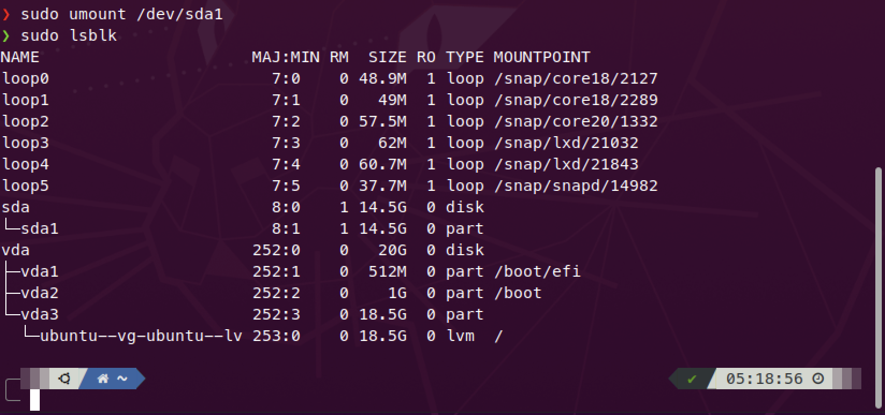

5.- Creamos una nueva carpeta donde se montará la USB nuevamente.

```bash
sudo mkdir /mnt/disks
sudo mkdir /mnt/disks/usb
```

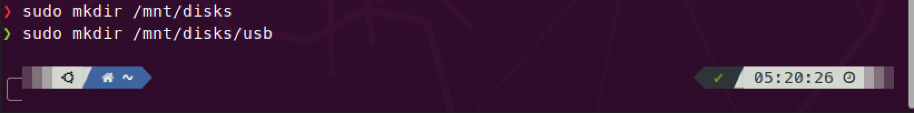

6.- Montamos la USB ben el nuevo path __/mt/disks/usb__.

```bash
sudo mount /dev/sda1 /mnt/disks/usb
```

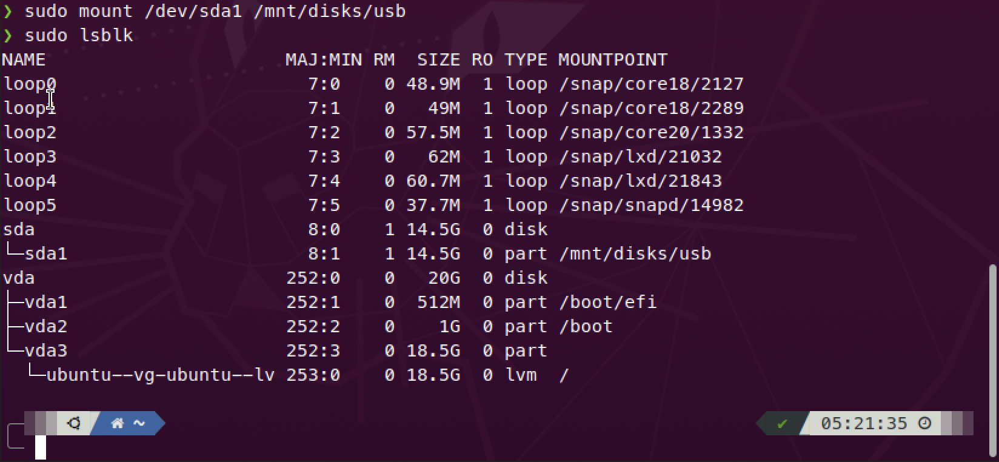

7.- Ya se puede acceder a la información de la USB en el path __/mt/disks/usb__.

```bash
cd /mt/disks/usb
ls
```

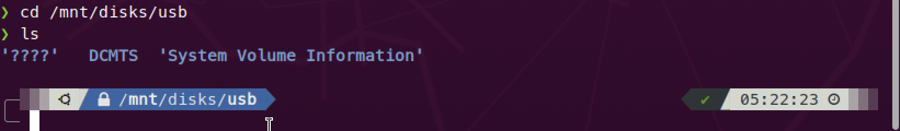

# 3.- Enlistar la información de los dispositivos.

1.- Entramos a la terminal.

2.- En la terminal usamos el comando:

```bash
lsblk
```


Con este comando podemos visualizar los dispositivos, unidades, particiones y sus capacidades (estén montadas o no).

3.- Si agregamos __-fm__ al comando, nuestra información es mas detallada.

```bash
lsblk -fm
```

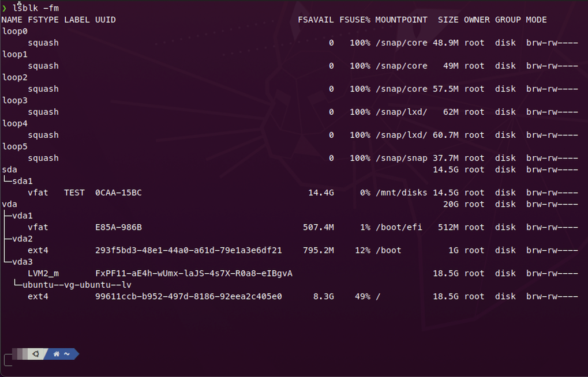

# 4.- Mostrar la tabla de particiones del disco del SO.

1.- Entramos a la terminal e ingresamos el comando:

```bash
sudo fdisk -l
```

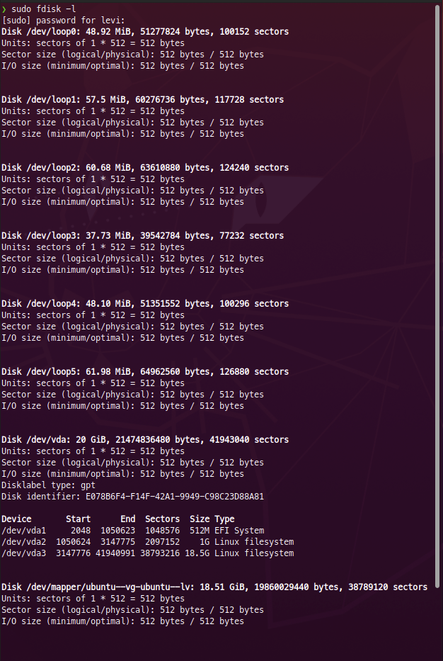

# 5.- Conectar USB y mostrar tabla de particiones.

1.- Conectamos la USB a la maquina y mostramos información.

```bash
sudo lsblk
```

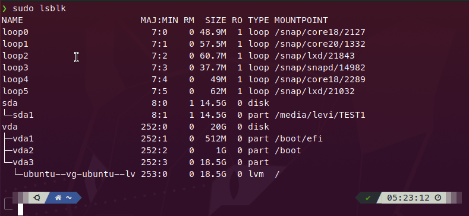

2.- Para mostrar su tabla de particiones usamos el comando:

```bash
sudo fdisk -l
```

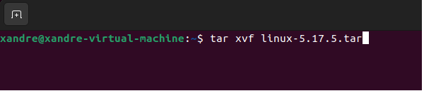

# 6.- Borrar todas las particiones del USB en terminal.

1.- Conectamos la USB y mostramos la información de los discos. Sabemos que la USB esta montada como el disco sda y tiene una partición.

__sda1__ montada en __/media/levi/TEST1__

```bash
sudo lsblk
```

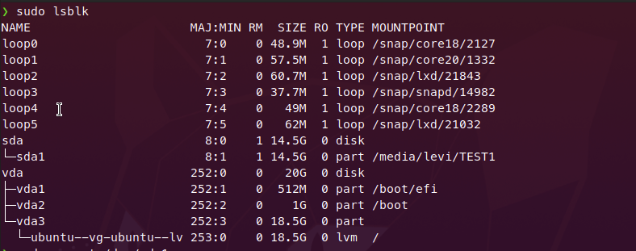

2.- Para desmontar la USB usamos los siguientes comandos:

```bash
sudo umount /dev/sda1
```

3 .- Usamos el siguiente comando para poder hacer modificaciones a las particiones de la USB.

```bash
sudo fdisk /dev/sda
```

4.- Dentro de __fdisk__ metemos el comando __d__ para borrar la partición. Una vez que estemos seguros de los cambios presionamos __w__ para guardar.

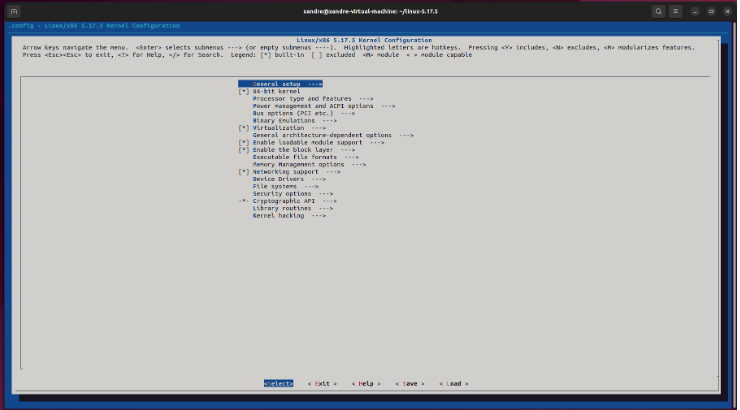

# 7.- Crear particiones físicas y extendidas en el USB.

1.- Conectamos la USB y mostramos la información de los discos para identificar cual es el disco que vamos a modificar.

```bash
sudo lsblk
```

2.- Desmontamos la USB para poder realizar operaciones en ella.

```bash
sudo umount /dev/sda1
```

3.- Utilizamos el comando __fdisk__ para crear __particiones__ (3 particiones primarias de 1GB c/u).

- Introducimos __n__ y luego __p__ para crear una partición primaria.
- Dejamos el primer sector como default
- Seleccionamos el ultimo sector usando __+1024M__ para indicar que la partición tendrá __1GB__

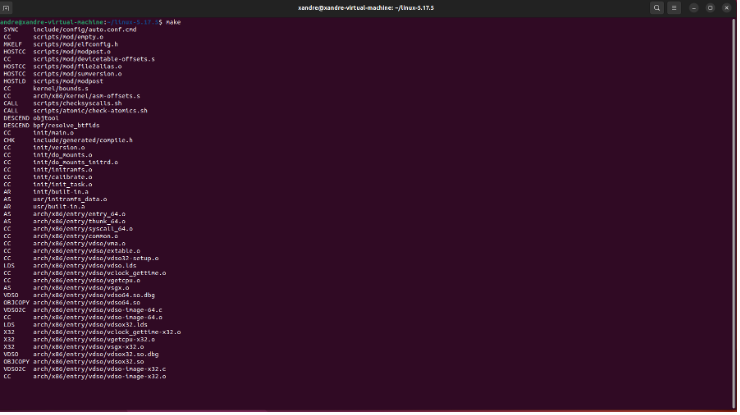

3.1.- Repetimos los pasos anteriores para crear las siguientes dos particiones.

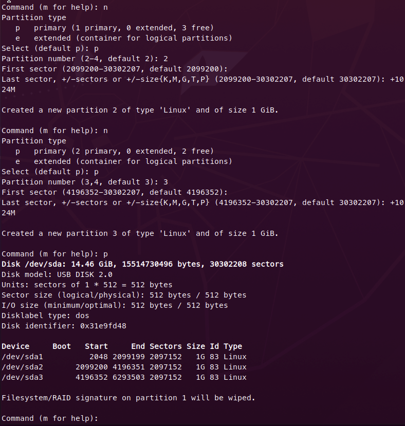

4.- Creamos una partición extendida en el espacio sobrante.

- Introducimos el comando __n__ y luego __e__ para crear una partición extendida.
- Repetimos los pasos del punto anterior

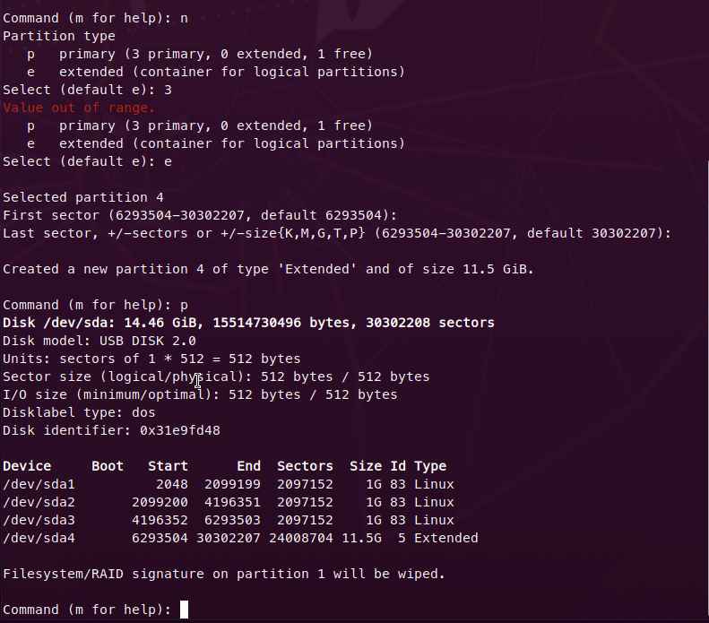

5.- Para finalizar introducimos __w__ para guardar los cambios.

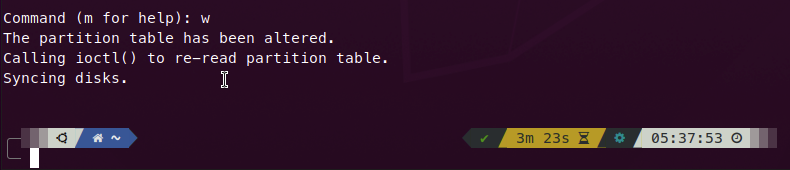

# 8.- Crear una partición dentro de la partición extendida en terminal.

0.- Para poder crear una partición lógica en un disco, es necesario contar con una partición extendida. En este ejemplo se muestra una USB con 3 particiones primarias y una extendida.

1.- Se debe desmontar la USB para poder realizar operaciones en ella.

```bash
sudo umount /dev/sda1
```

2.- Usamos el comando fdisk para crear la partición lógica.

- Si no existen 3 particiones primarias, introducimos l para seleccionar una partición lógica. Si ya existen particiones primarias (como este ejemplo), solo tendremos la opción de crear una partición lógica.
- Dejamos el primer sector en default.
- Dejamos el segundo sector en __512MiB__
- Introducimos __w__ para guardar

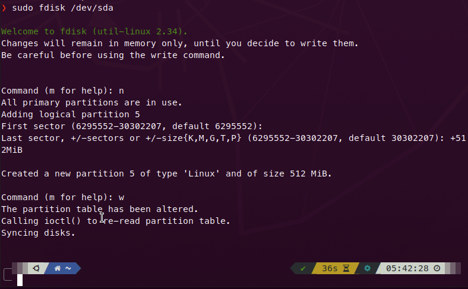

3.- Ahora podemos desplegar las particiones del disco.

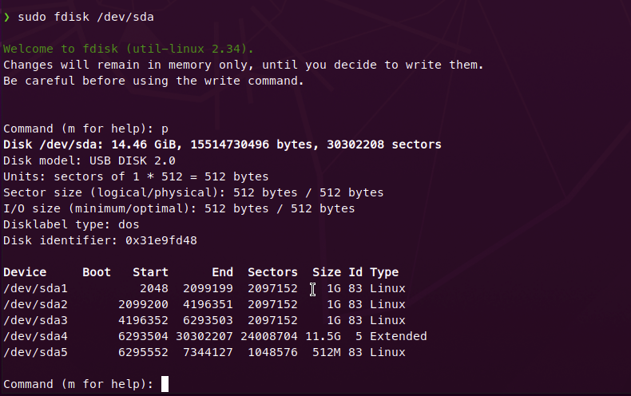

# 9.- Usar la aplicación ‘disks’.

1.- En Ubuntu abrimos la aplicación __disks__, en la que nos permite ver los dispositivos de almacenamiento que tengamos en nuestro equipo.

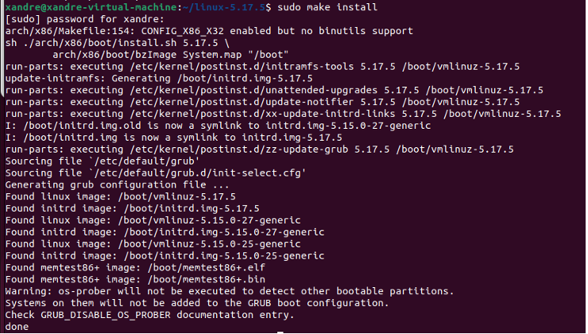

2.- Para eliminar una partición del disco, la seleccionamos, después seleccionamos el botón ‘-‘ y confirmamos que la queremos borrar.

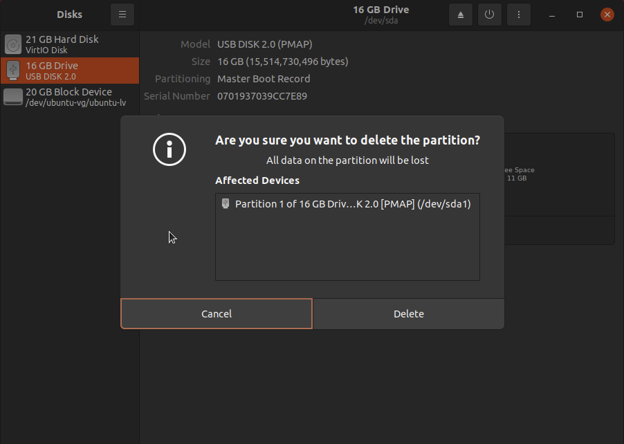

3.- Repetimos para todas las particiones y así la USB queda libre.


# 10.- Copiar un archivo .iso de Linux a USB por comando ‘dd’.

0.- Debemos contar con una imagen de disco .iso de la ditribucion de Linux.

1.- Conectamos la USB y mostramos información.

```bash
sudo lsblk
```

2.- Desmontamos la USB para poder realizar operaciones en ella

```bash
sudo umount /dev/sda1
```

3.- Ahora usaremos el comando __dd__ para quemar la imagen en la USB y poder usarla para bootear desde ella

- En el argumento __if__ se selecciona la imagen que se quiere usar 
- En el argumento __of__ se selecciona el disco en formato __/dev/sda1__

```bash
sudo dd if =[.iso] of=[disk] bs=1M status=progress
```

Ejemplo:
```bash
sudo dd if=/home/levi/Documents/Ubuntu-20.04.3-desktop-amd64.iso of=/dev/sdb2 bs=1M status=progress
```

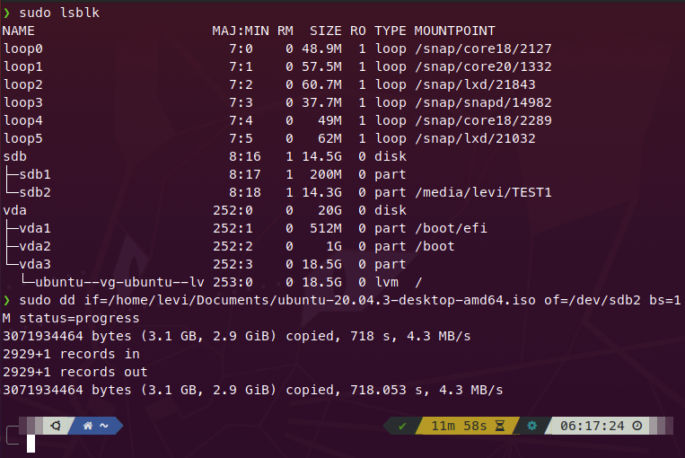
