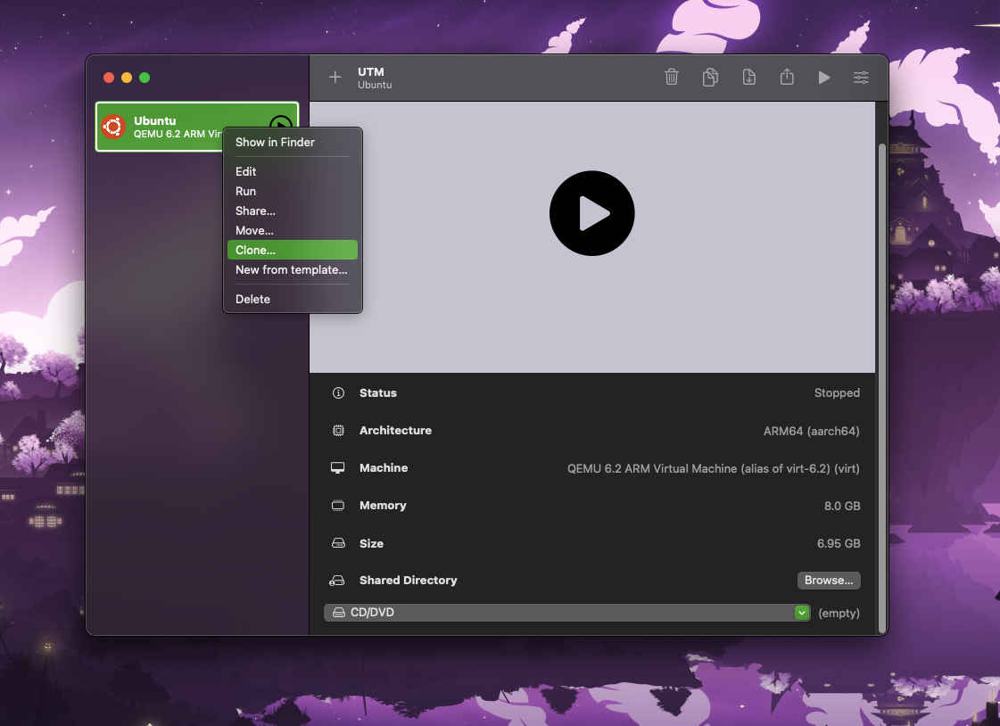
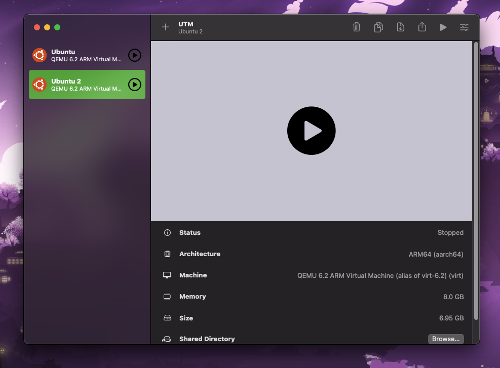
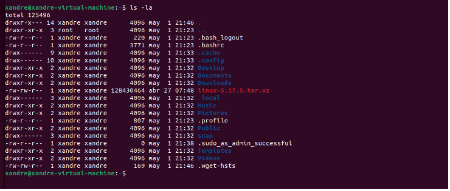
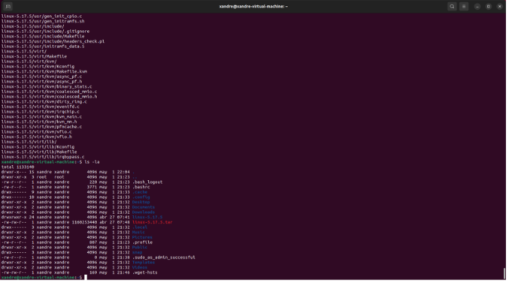
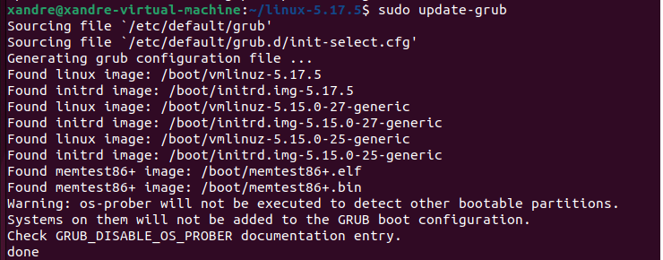
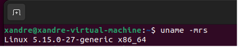
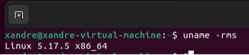

# Practica 3 - Compilación del Kernel de Linux.

-Integrantes-
- Sebastián Azamar Avilés.
- Karime Aylen de la Cruz Vargas.
- Carolina Gonzalez Gonzalez.
- Martín Granados Reyes.

# 1. ¿Cómo hacer un respaldo de una maquina virtual?
Dentro de cada software existen diferntes herramientas que nos permiten clonar nuestra maquina virtual, en uno de nuestros casos solo basta con hacer click derecho y dar en la opcion de clonar.



Con esto ya quedaría hecha nuestra copia y podemos hacer uso de ella.



# 2. Nomenclatura del kernel

El kernel tiene cuatro campos:
-	El primer campo hace referencia a la versión.
-	El segundo campo hace referencia a la subversión en donde si el primer numero es par, la versión es estable, si es impar, este será inestable.
-	El tercer campo hace referencia al nivel de corrección en el que se encuentra.
-	El cuarto campo hace referencia al nivel de parches y errores corregidos.

# 3. ¿Qué paquetes son requeridos para la compilación?

Los paquetes son:
-	libncurses-dev que contiene los headers, librerías estáticas y links simbólicos que se necesitan para usar ncurses.
-	libssl-dev: Contiene las librerías, headers, y manpages para libssl y libcrypto
-	libelf-dev: Contiene las librerías y headers para libelf1.
-	Bision: Es un programa generado de analizadores sintácticos.
-	Flex: Es una herramienta para crear analizadores léxicos.
-	Build-essentials: Son metapaquetes que son necesarios para compilar un software que contiene el GNU debbuger, la colección del compilador g++/GNU, y herramientas que se requieren para la compilación de programas.

Para instalarlos desde terminal se usan los comandos:

```bash
sudo apt-get install build-essential libncurses-dev bison flex libssl-dev libelf-dev
```
```bash
sudo apt-get update && apt-get install build-essential libncurses5-dev gcc libssl-dev bc
```


# 4. ¿Cómo descargar una versión de kernel desde terminal?

Desde la pagina https://www.kernel.org se puede elegir la version deseada del kernel.

Se descargara la version mas actual y estable que ofrece la pagina con el comando:

```bash
wget https://cdn.kernel.org/pub/linux/kernel/v5.x/linux-5.17.5.tar.xz
```




# 5. ¿Cómo extraer el codigo comprimido del kernel desde terminal?

Para descomprimir los archivos del kernel desde terminal se uso el comando unxz que es equivalente a descomprimir archivos .xz que es el caso del archivo del kernel.

```bash
unxz linux-5.17.5.tar.xz
```


Con el comando tar -xvf “Nombre de archivo”.tar descomprimes el archivo en el directorio actual.




# 6. ¿Cómo configurar el kernel?

Para configurar el kernel primero hay que moverse al directorio que se acaba de descomprimir con:

```bash
cd linux-5.17.5
```
Después se usara el siguiente comando para crear el archivo .config que usaremos para la compilación:

```bash
cp -v /boot/config-$(uname -r) .config
```


Otra forma de configurar el kernel es por medio del comando:

```bash
make menuconfig
```

el cual abrirá un menú que nos permite configurar el kernel


# 7. ¿Cómo compilar el código del kernel?

Una vez configurado el kernel se tienen que desactivar las llaves de confianza, revocación, y de modelos con los siguientes comandos:

```bash
scripts/config --disable SYSTEM_TRUSTED_KEYS
```
```bash
scripts/config --disable SYSTEM_REVOCATION_KEYS
```
```bash
scripts/config --disable MODULE_SIG_KEY
```

Después se usara el comando:

```bash
make
```

Para compilar el kernel


# 8. ¿Cómo instalar módulos?

Una vez compilado el kernel instalamos los modulos con el comando:

```bash
sudo make modules_install
```


# 9. ¿Cómo instalar el kernel?

Para instalar el kernel se usa el comando:

```bash
sudo make install
```


# 10. ¿Cómo indicarle a la computadora con cuál kernel debe iniciar?

Para indicarle a la computadora cual kernel se quiere usar al momento de iniciar se usa el comando:

```bash
sudo update-initramfs -c -k 5.17.5
```


Seguido de:

```bash
sudo update-grub
```



Después de esto se deberá reiniciar la computadora con:

```bash
sudo reboot
```

# 11. ¿Cómo verificar el cambio de kernel a partir de consola?

Para verificar el cambio de versión de kernel se usara el comando:

```bash
uname -rms
```

Versión anterior:



Versión actual:


